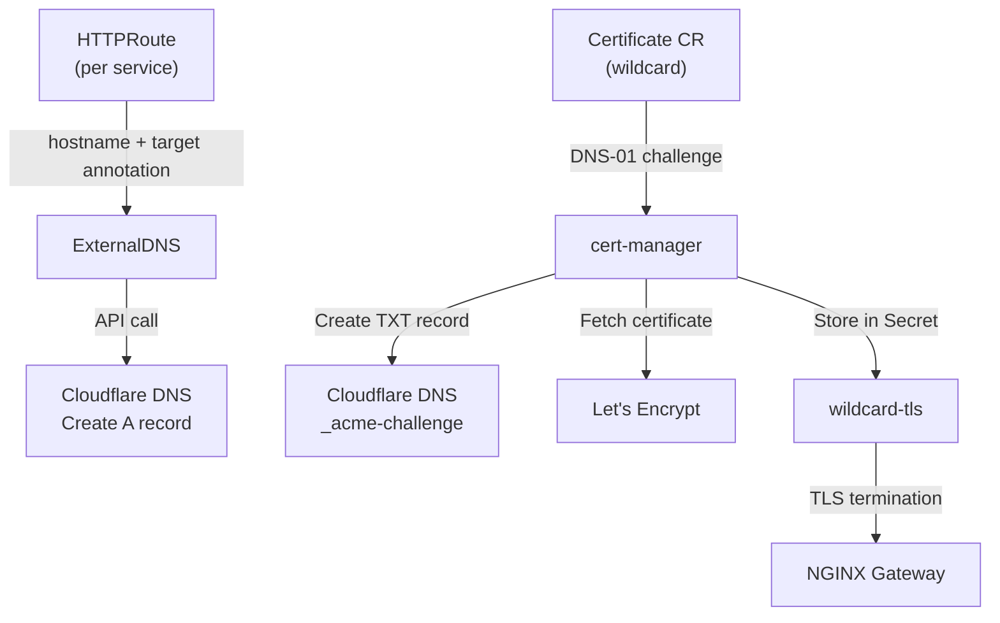

# DNS & TLS Setup

Easy-Deploy automates DNS record creation and TLS certificate provisioning. This guide covers the setup and configuration of these components.

## Architecture



## Cloudflare Setup

### API Token

Create a Cloudflare API token at [dash.cloudflare.com/profile/api-tokens](https://dash.cloudflare.com/profile/api-tokens):

| Permission | Setting |
|-----------|---------|
| Zone: DNS | Edit |
| Zone: Zone | Read |
| Zone Resources | Include → Specific zone → your domain |

### DNS Records

ExternalDNS manages DNS records automatically. You don't need to create them manually. The platform creates A records pointing to your worker node's public IP.

!!! info "Existing Records"
    If you have existing DNS records for your domain, ExternalDNS only manages records it creates. It won't modify or delete your existing records (unless they conflict with an HTTPRoute hostname).

## ExternalDNS Configuration

ExternalDNS is deployed via ArgoCD with these key settings:

| Setting | Value |
|---------|-------|
| Provider | `cloudflare` |
| Source | `gateway-httproute` |
| Domain filter | Your domain (e.g., `easysolution.work`) |
| Record type | A records |

ExternalDNS reads the `external-dns.alpha.kubernetes.io/target` annotation from HTTPRoutes to determine the A record value.

## cert-manager Configuration

### ClusterIssuer

Two ClusterIssuers are configured:

| Issuer | Purpose | ACME Server |
|--------|---------|-------------|
| `letsencrypt-prod` | Production certificates | `acme-v02.api.letsencrypt.org` |
| `letsencrypt-staging` | Testing (fake certs) | `acme-staging-v02.api.letsencrypt.org` |

Both use DNS-01 challenges via Cloudflare.

### Wildcard Certificate

A single wildcard certificate covers all subdomains:

```yaml
apiVersion: cert-manager.io/v1
kind: Certificate
metadata:
  name: wildcard-easysolution
  namespace: nginx-gateway
spec:
  secretName: wildcard-tls
  issuerRef:
    name: letsencrypt-prod
    kind: ClusterIssuer
  dnsNames:
    - "*.easysolution.work"
```

### Certificate Verification

```bash
# Check certificate status
kubectl -n nginx-gateway get certificate wildcard-easysolution

# Check certificate details
kubectl -n nginx-gateway describe certificate wildcard-easysolution

# Check the TLS secret
kubectl -n nginx-gateway get secret wildcard-tls
```

### Certificate Renewal

cert-manager automatically renews the certificate 30 days before expiry. No manual intervention needed.

To force renewal:

```bash
kubectl -n nginx-gateway delete secret wildcard-tls
# cert-manager will detect the missing secret and issue a new certificate
```

## Changing the Domain

To use a different domain:

1. **Update Cloudflare secrets** in both `external-dns` and `cert-manager` namespaces
2. **Update the Gateway** in `manifests/gateway/gateway.yaml`
3. **Update the Certificate** in `manifests/gateway/wildcard-certificate.yaml`
4. **Update the ClusterIssuer** DNS zones in `manifests/gateway/cluster-issuer.yaml`
5. **Update the operator** `BASE_DOMAIN` environment variable in `manifests/operator/deployment.yaml`
6. Push changes — ArgoCD syncs everything

## Changing the Target IP

If your worker node's public IP changes:

1. Update `TARGET_IP` in `manifests/operator/deployment.yaml`
2. Update the Gateway annotation in `manifests/gateway/gateway.yaml`
3. Push changes
4. Existing DNS records will be updated by ExternalDNS on the next reconciliation

## Troubleshooting

### DNS Not Resolving

```bash
# Check ExternalDNS logs
kubectl -n external-dns logs deployment/external-dns --tail=30

# Verify DNS from external resolver
dig myapp-dev.easysolution.work @1.1.1.1
```

### Certificate Not Issuing

```bash
# Check cert-manager logs
kubectl -n cert-manager logs deployment/cert-manager --tail=30

# Check ACME orders
kubectl get orders -A
kubectl get challenges -A
```

Common issues:

| Issue | Cause | Fix |
|-------|-------|-----|
| `no configured challenge solvers` | Selector mismatch in ClusterIssuer | Use `dnsZones` instead of `dnsNames` |
| `Timeout` | Cloudflare API token permissions | Verify token has DNS Edit + Zone Read |
| `NXDOMAIN` on challenge | DNS propagation delay | Wait and retry |
