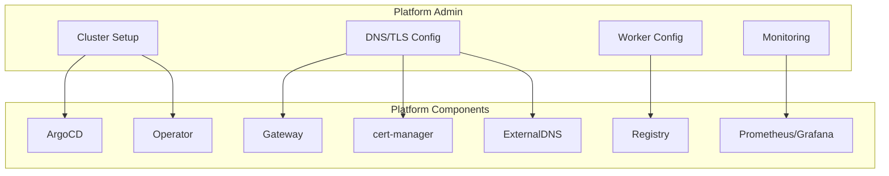

# Admin Guide

This section covers cluster administration tasks for the Easy-Deploy platform. It is intended for platform engineers and cluster administrators.

## Responsibilities

As a platform admin, you manage:

| Area | Description |
|------|-------------|
| **Cluster Setup** | Initial installation and ArgoCD configuration |
| **Worker Nodes** | DNS forwarding and containerd configuration |
| **DNS & TLS** | Cloudflare integration and certificate management |
| **Monitoring** | Prometheus, Grafana dashboards, and alerting |
| **Upgrades** | Operator image updates and CRD migrations |

## Operational Overview

## Guides

| Guide | Description |
|-------|-------------|
| [Cluster Setup](cluster-setup.md) | Full installation walkthrough |
| [Worker Node Configuration](worker-node-config.md) | DNS forwarding and insecure registry setup |
| [DNS & TLS Setup](dns-tls-setup.md) | Cloudflare, ExternalDNS, cert-manager configuration |
| [Monitoring](monitoring.md) | Prometheus and Grafana setup |
