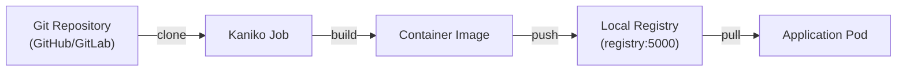
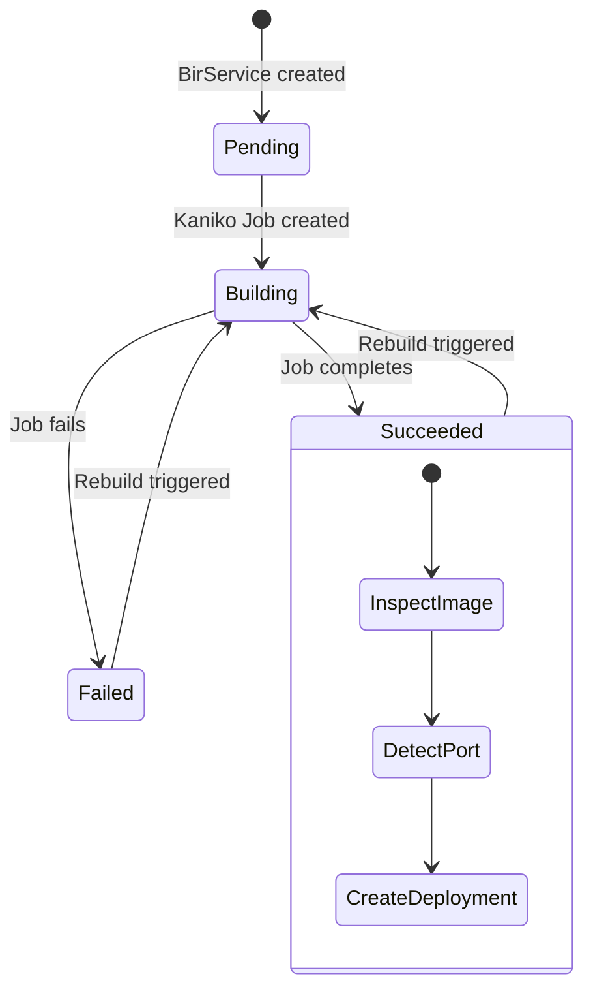

# Build Pipeline

Easy-Deploy includes a complete in-cluster CI pipeline that builds container images from Git repositories without requiring Docker-in-Docker or any external CI system.

## Overview



## Kaniko

[Kaniko](https://github.com/GoogleContainerTools/kaniko) is a tool to build container images inside a Kubernetes cluster. Unlike Docker-in-Docker, Kaniko doesn't require privileged access or a Docker daemon.

The operator creates a Kaniko Job with these arguments:

| Argument | Value | Purpose |
|----------|-------|---------|
| `--context` | `git://<repo-path>[#refs/heads/<tag>]` | Git repository to clone |
| `--dockerfile` | `Dockerfile` (or custom path) | Dockerfile path relative to repo root |
| `--destination` | `registry.registry.svc.cluster.local:5000/<name>:<tag>` | Where to push the built image |
| `--insecure` | (flag) | Allow HTTP push to the local registry |
| `--cache=false` | (flag) | Disable layer caching |

### Git Context Format

Kaniko supports cloning Git repositories directly:

```
# Default branch
git://github.com/user/repo

# Specific branch or tag
git://github.com/user/repo#refs/heads/v2.0.0
```

!!! note
    If no `tag` is specified in the BirService YAML, the operator omits the branch reference, letting Kaniko use the repository's default branch.

## Local Registry

The platform runs a Docker Registry v2 instance inside the cluster:

| Property | Value |
|----------|-------|
| **Image** | `registry:2` |
| **Namespace** | `registry` |
| **Internal DNS** | `registry.registry.svc.cluster.local:5000` |
| **NodePort** | `30500` |
| **Storage** | `hostPath` on the node |
| **Protocol** | HTTP (insecure — cluster-internal only) |

### Image Naming

Built images follow this naming convention:

```
registry.registry.svc.cluster.local:5000/<birservice-name>:<tag>
```

Examples:

| BirService | Tag | Image |
|-----------|-----|-------|
| `welcome` | (default) | `registry.registry.svc.cluster.local:5000/welcome:latest` |
| `myapp` | `v2.0.0` | `registry.registry.svc.cluster.local:5000/myapp:v2.0.0` |

## Build Lifecycle



### Status Tracking

The BirService `status` tracks the build lifecycle:

| Field | Example | Description |
|-------|---------|-------------|
| `buildStatus` | `Building` | Current build state |
| `buildImage` | `registry.../welcome:latest` | Full image reference |
| `buildTag` | `v2.0.0` | Tag used for the current build |
| `lastRebuild` | `1709567890` | Unix timestamp of last webhook rebuild |

## Port Auto-Detection

After a successful build, the operator queries the registry's v2 API to inspect the image configuration and auto-detect the application port.

The inspection checks (in order of priority):

1. **`EXPOSE` directive** — `ExposedPorts` in the image config
2. **`ENV PORT=`** — Environment variable in the image config
3. **`CMD --port`** or **`ENTRYPOINT -p`** — Port flags in the command

If none are found, the platform falls back to port `8080`.

See [Port Auto-Detection](../user-guide/auto-detection.md) for details.

## Worker Node Requirements

For the build pipeline to work end-to-end, worker nodes must be configured to:

1. **Resolve cluster DNS** — containerd needs to resolve `registry.registry.svc.cluster.local`
2. **Allow insecure pull** — containerd needs to pull from an HTTP (non-TLS) registry

See [Worker Node Configuration](../admin-guide/worker-node-config.md) for setup instructions.
