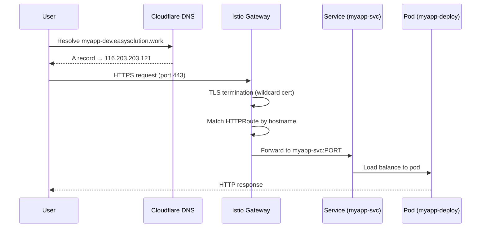

# Architecture Overview

Easy-Deploy is built as a collection of loosely coupled Kubernetes-native components, each handling a specific concern. Together, they transform a single-line YAML into a fully deployed, HTTPS-enabled, DNS-routed application.

## High-Level Architecture

```mermaid
graph TB
    subgraph Developer
        YAML["1-line YAML<br/>(BasePlate-Dev repo)"]
    end

    subgraph GitOps["GitOps Layer"]
        ArgoCD["ArgoCD"]
        AppSet["ApplicationSet"]
        Helm["Helm Chart<br/>(birservice)"]
    end

    subgraph Control["Control Plane"]
        CRD["BirService CR"]
        Operator["Easy-Deploy<br/>Operator"]
        Webhook["Webhook Server"]
    end

    subgraph Build["Build Pipeline"]
        Kaniko["Kaniko Job"]
        Registry["Local Registry"]
    end

    subgraph Runtime["Runtime Layer"]
        Deploy["Deployment"]
        Svc["Service"]
        Route["HTTPRoute"]
    end

    subgraph Network["Network & DNS"]
        Gateway["Istio<br/>Gateway"]
        ExtDNS["ExternalDNS"]
        CertMgr["cert-manager"]
    end

    YAML --> ArgoCD
    ArgoCD --> AppSet
    AppSet --> Helm
    Helm --> CRD
    CRD --> Operator

    Operator -->|"Git repo"| Kaniko
    Kaniko --> Registry
    Registry --> Deploy

    Operator -->|"Ready image"| Deploy
    Operator --> Svc
    Operator --> Route

    Route --> Gateway
    Route --> ExtDNS
    CertMgr --> Gateway

    Webhook -->|"rebuild trigger"| Operator
```



## Component Responsibilities

### GitOps Layer

| Component | Responsibility |
|-----------|---------------|
| **ArgoCD** | Watches Git repositories and keeps cluster state in sync |
| **ApplicationSet** | Auto-discovers `*/*.yaml` (service_name/namespace_name.yaml) files and creates ArgoCD Applications |
| **Helm Chart** | Converts the developer's simple YAML into a `BirService` custom resource |

### Control Plane

| Component | Responsibility |
|-----------|---------------|
| **BirService CRD** | Defines the API contract between developers and the platform |
| **Operator** | Reconciles BirService CRs into Deployments, Services, HTTPRoutes, and Kaniko Jobs |
| **Webhook Server** | Receives GitHub push events and triggers rebuilds |

### Build Pipeline

| Component | Responsibility |
|-----------|---------------|
| **Kaniko** | Builds container images inside the cluster without requiring Docker-in-Docker |
| **Local Registry** | Stores built images at `registry.registry.svc.cluster.local:5000` |

### Network & DNS

| Component | Responsibility |
|-----------|---------------|
| **Istio Gateway** | Routes HTTP/HTTPS traffic to services based on hostname (Gateway API) |
| **ExternalDNS** | Creates Cloudflare DNS A records from HTTPRoute annotations |
| **cert-manager** | Provisions and renews TLS certificates from Let's Encrypt |

## Namespace Layout

```
Namespace              Components
─────────              ──────────
argocd                 ArgoCD server, repo server, application controller
easy-deploy-system     Easy-Deploy operator, webhook server
nginx-gateway          Istio ingress gateway (main-gateway) data plane
cert-manager           cert-manager controller, webhook, CA injector
external-dns           ExternalDNS controller
registry               Docker Registry v2
monitoring             Prometheus, Grafana, Alertmanager
dev                    Developer workloads (dev environment)
staging                Developer workloads (staging environment)
preprod                Developer workloads (pre-production environment)
```

## Request Flow

When a user accesses `https://myapp-dev.easysolution.work`:



## Two-Repository Model

Easy-Deploy uses two separate Git repositories:

| Repository | Purpose | Who Edits It |
|-----------|---------|-------------|
| **BasePlate** (this repo) | Platform code — operator, CRDs, manifests, Helm chart, ArgoCD apps | Platform engineers |
| **BasePlate-Dev** | Developer catalog — simple YAML files for each application | Application developers |

This separation ensures developers cannot accidentally modify platform infrastructure, and platform changes don't trigger unnecessary application resyncs.

## Next Steps

- [Operator Deep Dive](operator.md) — How the reconciliation loop works
- [Build Pipeline](build-pipeline.md) — Kaniko builds and the local registry
- [Networking & TLS](networking.md) — Gateway, DNS, and certificate management
