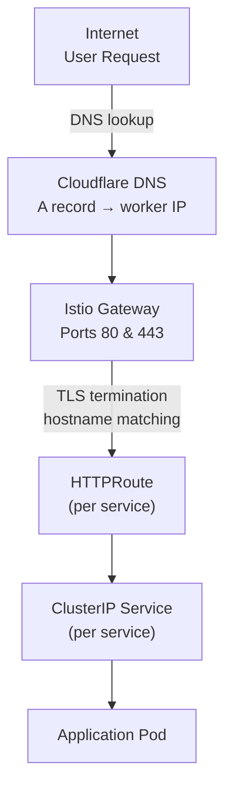
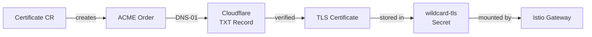

# Networking & TLS

Easy-Deploy uses the Kubernetes Gateway API for traffic routing, combined with ExternalDNS for automatic DNS management and cert-manager for TLS certificates.

## Traffic Flow



## Istio Gateway

The platform uses [Istio](https://istio.io/) as the Gateway API implementation. The same Istio control plane runs the service mesh, so north-south (ingress) and east-west (mesh) traffic share one data plane.

### Gateway Resource

A single `Gateway` resource defines two listeners:

```yaml
apiVersion: gateway.networking.k8s.io/v1
kind: Gateway
metadata:
  name: main-gateway
  namespace: nginx-gateway
  annotations:
    # Istio auto-provisions the gateway Service; ClusterIP avoids a
    # permanently-pending LoadBalancer on bare metal.
    networking.istio.io/service-type: ClusterIP
spec:
  gatewayClassName: istio
  listeners:
    - name: http
      port: 80
      protocol: HTTP
      allowedRoutes:
        namespaces:
          from: All
    - name: https
      port: 443
      protocol: HTTPS
      allowedRoutes:
        namespaces:
          from: All
      tls:
        mode: Terminate
        certificateRefs:
          - kind: Secret
            name: wildcard-tls
            namespace: nginx-gateway
```

Key design decisions:

- **`from: All`** — allows HTTPRoutes from any namespace to attach to this gateway
- **TLS termination** — the gateway handles TLS using the wildcard certificate
- **Single gateway** — all services share the same gateway, differentiated by hostname

### Node IP Binding

Istio auto-provisions the gateway data plane (Deployment + Service) for the `main-gateway` Gateway. This is a bare-metal cluster with no cloud LoadBalancer controller, so the `gateway-config` chart adds a companion `Service` (`main-gateway-external`) of type `ClusterIP` with `spec.externalIPs` set to the worker node's public IP. kube-proxy then routes `<node-IP>:80` and `:443` straight to the gateway pods — no `NodePort` or cloud `LoadBalancer` required.

## ExternalDNS

[ExternalDNS](https://github.com/kubernetes-sigs/external-dns) watches HTTPRoute resources and creates DNS records on Cloudflare.

### How It Works

1. The operator creates an HTTPRoute with an annotation:
   ```yaml
   annotations:
     external-dns.alpha.kubernetes.io/target: "116.203.203.121"
   ```
2. ExternalDNS reads the HTTPRoute's `hostnames` field and the `target` annotation
3. Creates a Cloudflare DNS **A record**: `myapp-dev.easysolution.work → 116.203.203.121`

### DNS Propagation

!!! warning "DNS Cache"
    After a new service is deployed, it may take 1–5 minutes for DNS records to propagate. If you see `DNS_PROBE_FINISHED_NXDOMAIN`:

    - Wait a few minutes for propagation
    - Flush your local DNS cache (`ipconfig /flushdns` on Windows)
    - Try using `1.1.1.1` or `8.8.8.8` as your DNS resolver to avoid ISP caching

## cert-manager

[cert-manager](https://cert-manager.io/) provisions TLS certificates from Let's Encrypt.

### Wildcard Certificate

The platform uses a single wildcard certificate covering all subdomains:

```yaml
apiVersion: cert-manager.io/v1
kind: Certificate
metadata:
  name: wildcard-easysolution
  namespace: nginx-gateway
spec:
  secretName: wildcard-tls
  issuerRef:
    name: letsencrypt-prod
    kind: ClusterIssuer
  dnsNames:
    - "*.easysolution.work"
```

### DNS-01 Challenge

The wildcard certificate requires a DNS-01 challenge (HTTP-01 cannot issue wildcards). The `ClusterIssuer` is configured to use Cloudflare's API:

```yaml
solvers:
  - dns01:
      cloudflare:
        apiTokenSecretRef:
          name: cloudflare-api-token
          key: cloudflare_api_token
    selector:
      dnsZones:
        - "easysolution.work"
```

cert-manager:

1. Creates a `_acme-challenge.easysolution.work` TXT record via Cloudflare API
2. Let's Encrypt verifies the record
3. Certificate is issued and stored in `wildcard-tls` Secret
4. The Istio Gateway references this Secret for TLS termination
5. cert-manager automatically renews the certificate before expiry

### Certificate Lifecycle



## Hostname Pattern

Every service gets a hostname following this pattern:

```
<service-name>-<namespace>.<base-domain>
```

| Service | Namespace | Hostname |
|---------|-----------|----------|
| `echo` | `dev` | `echo-dev.easysolution.work` |
| `myapp` | `staging` | `myapp-staging.easysolution.work` |
| `api` | `preprod` | `api-preprod.easysolution.work` |

Developers can override this by setting `hostname:` in their YAML.

## Cross-Namespace References

HTTPRoutes in developer namespaces reference the gateway in the `nginx-gateway` namespace. The TLS certificate Secret also lives in `nginx-gateway`. **ReferenceGrants** are configured to allow these cross-namespace references:

```
developer namespace (dev, staging, ...)
    └── HTTPRoute
            └── parentRef → nginx-gateway/main-gateway ✓ (ReferenceGrant)
```
