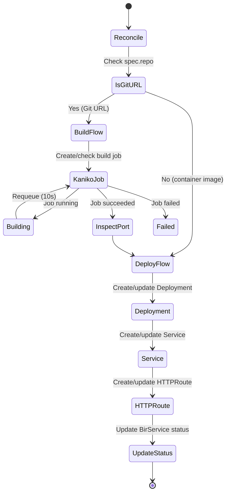

# The Operator

The Easy-Deploy operator is the brain of the platform. It watches `BirService` custom resources and reconciles them into the Kubernetes primitives needed to run an application.

## Overview

The operator is built with the [controller-runtime](https://github.com/kubernetes-sigs/controller-runtime) library and follows the standard Kubernetes operator pattern: watch a custom resource, compare desired state with actual state, and make changes to converge.



## Reconciler Structure

The `BirServiceReconciler` has two main paths:

### Direct Image Path

When `spec.image` is set (or `spec.repo` is a container registry reference):

1. Resolve the image name and tag
2. Create or update a **Deployment** with the container image
3. Create or update a **ClusterIP Service** forwarding to the container port
4. Create or update an **HTTPRoute** with hostname, gateway reference, and DNS annotation
5. Update `status.availableReplicas`

### Git Build Path

When `spec.repo` is a Git URL (GitHub, GitLab, Bitbucket):

1. Determine the image tag (from `spec.tag` or default to `latest`)
2. Check if a rebuild is needed (tag change or webhook annotation)
3. If rebuilding, delete old build jobs
4. Create a **Kaniko Job** with the Git context and destination registry
5. Wait for the job to complete (requeue every 10 seconds)
6. On success, **inspect the image** to auto-detect the port
7. Proceed with the same Deployment → Service → HTTPRoute flow

## Resources Created

For each `BirService`, the operator creates and manages:

| Resource | Naming Pattern | Created When |
|---|---|---|
| `Deployment` | `<name>-deploy` | always |
| `Service` (ClusterIP) | `<name>-svc` | always |
| `HTTPRoute` | `<name>-route` | `expose: true` and hostname resolvable |
| `HorizontalPodAutoscaler` | `<name>-hpa` | `hpa.minReplicas`+`maxReplicas` set, `replicas` not set |
| `PodDisruptionBudget` | `<name>-pdb` | effective replicas ≥ 2 and `singleton: false` |
| `ServiceMonitor` | `<name>-monitor` | `metrics` enabled (default true) |
| `DestinationRule` | `<name>-outlier` | mesh-enabled (`traffic:` present); carries outlier detection + LB policy |
| `EnvoyFilter` | `<name>-ratelimit` | `traffic.rateLimit.enabled: true` |
| `Job` (Kaniko) | `<name>-build-<tag>` | first build of a Git repo |
| `Deployment` (canary) | `<name>-canary-deploy` | `canary.enabled: true` |
| `Service` (canary) | `<name>-canary-svc` | `canary.enabled: true` |

All resources are owned by the `BirService` CR via `controllerutil.SetControllerReference`, so they are garbage collected when the CR is deleted.

The waypoint `Gateway` (one per namespace) is shared across all mesh-enabled BirServices in the namespace and only torn down when the last sibling stops needing the mesh.

## Labels

Every resource created by the operator carries these labels:

```yaml
labels:
  app.kubernetes.io/name: <birservice-name>
  app.kubernetes.io/managed-by: easy-deploy-operator
  deploy.easydeploy.io/tenant: <namespace>
```

Build jobs additionally carry:

```yaml
labels:
  deploy.easydeploy.io/purpose: build
  deploy.easydeploy.io/build-tag: <tag>
```

## Hostname Resolution

The operator generates hostnames using this logic:

```
if spec.hostname is set:
    use spec.hostname
else if BASE_DOMAIN env var is set:
    use <name>-<namespace>.<BASE_DOMAIN>
else:
    no HTTPRoute created
```

For example, a BirService named `myapp` in namespace `staging` with `BASE_DOMAIN=easysolution.work` gets hostname `myapp-staging.easysolution.work`.

## HTTPRoute Configuration

The generated HTTPRoute references two parent listeners on the main gateway:

```yaml
parentRefs:
  - name: main-gateway
    namespace: nginx-gateway
    sectionName: http      # Port 80
  - name: main-gateway
    namespace: nginx-gateway
    sectionName: https     # Port 443
```

The route also carries an annotation for ExternalDNS:

```yaml
annotations:
  external-dns.alpha.kubernetes.io/target: "116.203.203.121"
```

This tells ExternalDNS to create a DNS A record pointing to the worker node's public IP.

## Environment Variables

The operator reads two environment variables at startup:

| Variable | Description | Example |
|----------|-------------|---------|
| `BASE_DOMAIN` | Domain suffix for auto-generated hostnames | `easysolution.work` |
| `TARGET_IP` | Public IP for DNS A records | `116.203.203.121` |

## Manager Setup

The operator registers watches for its owned resources:

```go
ctrl.NewControllerManagedBy(mgr).
    For(&deployv1alpha1.BirService{}).
    Owns(&appsv1.Deployment{}).
    Owns(&corev1.Service{}).
    Owns(&autoscalingv1.HorizontalPodAutoscaler{}).
    Owns(&batchv1.Job{}).
    Complete(r)
```

This means the reconciler is triggered when:

- A `BirService` is created, updated, or deleted
- A Deployment, Service, HPA, or Job owned by a BirService changes

Unstructured-typed resources (DestinationRule, EnvoyFilter, HTTPRoute, ServiceMonitor, Gateway, PDB) are not in the `Owns()` set — they use unstructured clients to avoid pulling third-party CRD types into the operator's dependency tree. They still carry owner references so deletion cascades.

## Health Probes

The operator exposes standard Kubernetes health probes:

| Endpoint | Port | Purpose |
|----------|------|---------|
| `/healthz` | 8081 | Liveness probe |
| `/readyz` | 8081 | Readiness probe |
| `/metrics` | 8080 | Prometheus metrics |

## Deployment Strategy

Strategy is a single domain knob — `spec.singleton`:

| `singleton` | Strategy | maxSurge | maxUnavailable | PDB |
|---|---|---|---|---|
| `false` / omitted | RollingUpdate | 25% | 0 | created when replicas ≥ 2 |
| `true` | Recreate | — | — | skipped (meaningless) |

`maxSurge=25% / maxUnavailable=0` is the industry SRE default: zero degradation during deploys, with 25% headroom for new pods to come up before old ones are terminated. These knobs are platform-managed — developers don't tune them.

A default TCP readiness probe is inserted on `containerPort` when the user does not declare `readinessProbe`. Without this, rolling updates would mark new pods Ready immediately on `Running`, causing premature old-pod termination while the new app is still initializing.

## Pod Topology Spread

Every Deployment gets a single **soft** topology spread constraint, platform-managed (no developer knob):

```
maxSkew: 1
topologyKey: kubernetes.io/hostname
whenUnsatisfiable: ScheduleAnyway
labelSelector: <this workload's pods>
```

`ScheduleAnyway` (soft) is deliberate: it spreads a workload's pods across nodes when more than one schedulable node exists, but degrades to packing on a single node otherwise. On a one-worker cluster it is a no-op and never strands replicas as `Pending` or blocks HPA scale-up. A hard `DoNotSchedule` constraint would break scheduling the moment replicas exceed the node count, so the platform never uses it. When the cluster grows, new pods automatically prefer emptier nodes with no config change.

## Disruption Budget

`PodDisruptionBudget.maxUnavailable` is derived from `spec.maxDown`:

```
effective_replicas = replicas | hpa.minReplicas | 1
max_down           = spec.maxDown | floor(effective_replicas / 2)   # minimum 1
```

The PDB is skipped when:

- `effective_replicas < 2` (no protection possible with one pod)
- `spec.singleton: true` (Recreate strategy, voluntary protection is meaningless)
- `max_down >= effective_replicas` (PDB would never block)

## Service Mesh (Istio Ambient)

Presence of `spec.traffic` opts the workload into Istio ambient mesh. The operator:

1. Labels the namespace with `istio.io/dataplane-mode=ambient` and `istio.io/use-waypoint=waypoint`.
2. Ensures a namespace-scoped `Gateway` named `waypoint` (`gatewayClassName: istio-waypoint`, `waypoint-for: all`). One waypoint Pod handles L7 traffic for all mesh-enabled siblings.
3. Labels the workload's `Service` and pod template with `istio.io/use-waypoint=waypoint`. Pod-level labeling is required because the ingress gateway resolves `Endpoints` and connects directly to pod IPs, bypassing service-VIP waypoint binding.
4. Composes a per-service `DestinationRule` from the relevant traffic-policy sections (see below).
5. Creates an `EnvoyFilter` when `traffic.rateLimit.enabled: true`.

### DestinationRule composition

One DR per service. `reconcileDestinationRule` adds sections only when enabled:

| Field | Section added when | Content |
|---|---|---|
| `outlierDetection` | `ejectUnhealthy != false` (default true) | 5 consecutive 5xx or 3 consecutive gateway errors (502/503/504) → 30s eject, max 50% of pods, panic mode disabled (minHealthPercent: 0) |
| `loadBalancer` | `latencyAware: true` | `simple: LEAST_REQUEST` |

When no section is needed, the DR is deleted entirely.

## Canary Rollouts

`spec.canary.enabled: true` triggers a parallel deployment:

1. The operator captures the current `status.buildTag` as `status.stableTag` (only on first enable).
2. The main `<name>-deploy` Deployment continues serving `stableTag`, even when new builds arrive.
3. A new `<name>-canary-deploy` runs the canary image (`spec.canary.tag` or `image`).
4. The HTTPRoute is rewritten with two weighted `backendRefs` — stable at `(100 - weight)%`, canary at `weight%`.

To promote: set `canary.enabled: false` (or remove the field). The operator tears down the canary infrastructure, clears `stableTag`, and the main Deployment picks up the latest build.

## Auto-Detected Image Inspection

For Git-built repos, after a successful build the operator inspects the resulting image to fill in defaults:

| Field | Inspected From | Fallback |
|---|---|---|
| `containerPort` | `EXPOSE`, `ENV PORT=`, `CMD --port=` in the image | Dockerfile `EXPOSE` line | none (uses `port`) |
| Tracing runtime | Image labels / Dockerfile FROM base | none (skip OTel injection) |

The detected port is persisted back to `spec.containerPort` so future reconciles skip the inspect step.

## Tracing

Tracing is **always on platform-wide** — no per-workload knobs. Pod templates get the OTel Operator's `instrumentation.opentelemetry.io/inject-<runtime>` annotation pointing at `observability/default` (a cluster-wide Instrumentation CR). `<runtime>` is detected automatically from the image (`dotnet`, `java`, `nodejs`, `python`, `go`).

When tracing is detected for .NET, the operator additionally injects `OTEL_DOTNET_AUTO_TRACES_ADDITIONAL_SOURCES=<bs.Name>` env var, because the .NET auto-instrumentation SDK requires explicit ActivitySource registration. Convention: source name equals the BirService name.

## Mesh Rollouts

When `spec.traffic` is *just added* to an existing workload, the namespace gets the ambient label retroactively. In sidecar mode this would require a rolling restart; in ambient mode pods don't run sidecars (ztunnel runs node-wide), so no restart is required. The `meshNeedsRolloutForSidecar` helper returns `false` in ambient — left as a hook for future provider support.

## Validation Layers

The operator is the **last** validation layer. Before reaching the reconciler:

1. IDE schema (`values.schema.json`) flags structural errors as the developer types.
2. Pre-commit hooks (`birservice-helm-validate` + `birservice-lint`) block bad commits locally.
3. PR CI (`validate.yml`) re-runs the same hooks; branch protection blocks merge.
4. K8s API server validates against the CRD's OpenAPI v3 schema on `kubectl apply`.

See [Validation](../user-guide/validation.md) for the full feedback loop.
