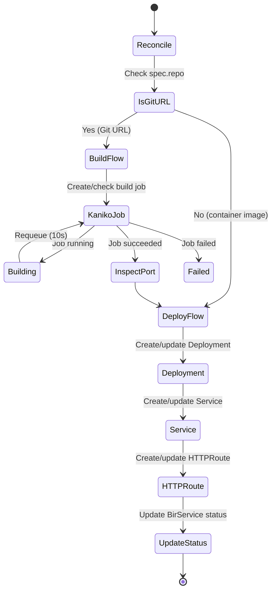

# The Operator

The Easy-Deploy operator is the brain of the platform. It watches `BirService` custom resources and reconciles them into the Kubernetes primitives needed to run an application.

## Overview

The operator is built with the [controller-runtime](https://github.com/kubernetes-sigs/controller-runtime) library and follows the standard Kubernetes operator pattern: watch a custom resource, compare desired state with actual state, and make changes to converge.



## Reconciler Structure

The `BirServiceReconciler` has two main paths:

### Direct Image Path

When `spec.image` is set (or `spec.repo` is a container registry reference):

1. Resolve the image name and tag
2. Create or update a **Deployment** with the container image
3. Create or update a **ClusterIP Service** forwarding to the container port
4. Create or update an **HTTPRoute** with hostname, gateway reference, and DNS annotation
5. Update `status.availableReplicas`

### Git Build Path

When `spec.repo` is a Git URL (GitHub, GitLab, Bitbucket):

1. Determine the image tag (from `spec.tag` or default to `latest`)
2. Check if a rebuild is needed (tag change or webhook annotation)
3. If rebuilding, delete old build jobs
4. Create a **Kaniko Job** with the Git context and destination registry
5. Wait for the job to complete (requeue every 10 seconds)
6. On success, **inspect the image** to auto-detect the port
7. Proceed with the same Deployment → Service → HTTPRoute flow

## Resources Created

For each `BirService`, the operator creates and manages:

| Resource | Naming Pattern | Description |
|----------|---------------|-------------|
| `Deployment` | `<name>-deploy` | Runs the application pods |
| `Service` | `<name>-svc` | ClusterIP service routing to pods |
| `HTTPRoute` | `<name>-route` | Gateway API route with hostname and DNS annotation |
| `Job` | `<name>-build-<tag>` | Kaniko build job (only for Git repos) |

All resources are owned by the `BirService` CR via `controllerutil.SetControllerReference`, so they are garbage collected when the CR is deleted.

## Labels

Every resource created by the operator carries these labels:

```yaml
labels:
  app.kubernetes.io/name: <birservice-name>
  app.kubernetes.io/managed-by: easy-deploy-operator
  deploy.easydeploy.io/tenant: <namespace>
```

Build jobs additionally carry:

```yaml
labels:
  deploy.easydeploy.io/purpose: build
  deploy.easydeploy.io/build-tag: <tag>
```

## Hostname Resolution

The operator generates hostnames using this logic:

```
if spec.hostname is set:
    use spec.hostname
else if BASE_DOMAIN env var is set:
    use <name>-<namespace>.<BASE_DOMAIN>
else:
    no HTTPRoute created
```

For example, a BirService named `myapp` in namespace `staging` with `BASE_DOMAIN=easysolution.work` gets hostname `myapp-staging.easysolution.work`.

## HTTPRoute Configuration

The generated HTTPRoute references two parent listeners on the main gateway:

```yaml
parentRefs:
  - name: main-gateway
    namespace: nginx-gateway
    sectionName: http      # Port 80
  - name: main-gateway
    namespace: nginx-gateway
    sectionName: https     # Port 443
```

The route also carries an annotation for ExternalDNS:

```yaml
annotations:
  external-dns.alpha.kubernetes.io/target: "116.203.203.121"
```

This tells ExternalDNS to create a DNS A record pointing to the worker node's public IP.

## Environment Variables

The operator reads two environment variables at startup:

| Variable | Description | Example |
|----------|-------------|---------|
| `BASE_DOMAIN` | Domain suffix for auto-generated hostnames | `easysolution.work` |
| `TARGET_IP` | Public IP for DNS A records | `116.203.203.121` |

## Manager Setup

The operator registers watches for its owned resources:

```go
ctrl.NewControllerManagedBy(mgr).
    For(&deployv1alpha1.BirService{}).
    Owns(&appsv1.Deployment{}).
    Owns(&corev1.Service{}).
    Owns(&batchv1.Job{}).
    Complete(r)
```

This means the reconciler is triggered when:

- A `BirService` is created, updated, or deleted
- A Deployment, Service, or Job owned by a BirService changes

## Health Probes

The operator exposes standard Kubernetes health probes:

| Endpoint | Port | Purpose |
|----------|------|---------|
| `/healthz` | 8081 | Liveness probe |
| `/readyz` | 8081 | Readiness probe |
| `/metrics` | 8080 | Prometheus metrics |
