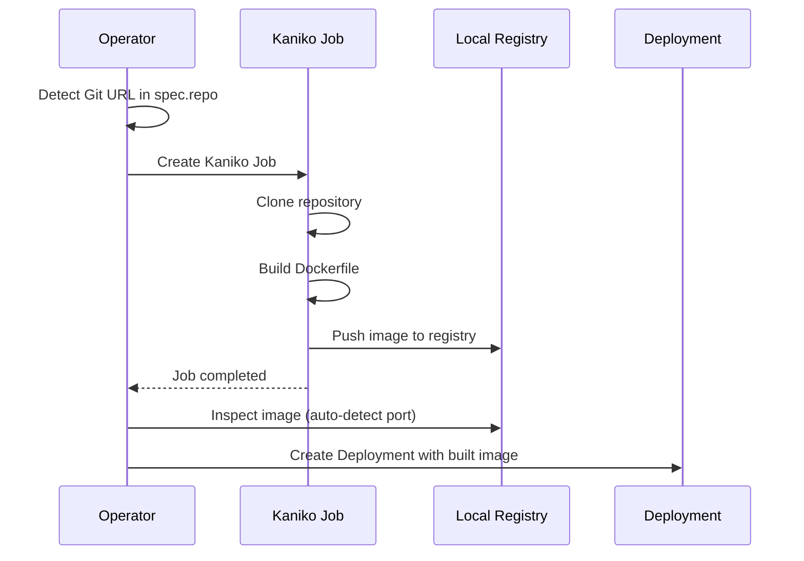

# First Deployment from Git

This guide walks you through deploying an application by building it from a Git repository — the platform's most powerful feature.

## Prerequisites

- Easy-Deploy platform is [installed](installation.md)
- Worker nodes are [configured](../admin-guide/worker-node-config.md) for the local registry

## Deploy Docker's Welcome App

**1.** Create a file at `tenants/dev/simple-yaml/welcome.yaml` in BasePlate-Dev:

```yaml
repo: https://github.com/docker/welcome-to-docker
```

That's it. One line.

**2.** Commit and push:

```bash
git add tenants/dev/simple-yaml/welcome.yaml
git commit -m "deploy welcome app from git"
git push
```

**3.** Monitor the build:

```bash
# Watch the BirService status
kubectl -n dev get birservice welcome -w

# Watch the Kaniko build job
kubectl -n dev get jobs
kubectl -n dev logs job/welcome-build-latest -f
```

**4.** Once the build succeeds and pods are running:

```
https://welcome-dev.easysolution.work
```

## Build Flow



The operator:

1. Detects that `repo:` is a Git URL (GitHub, GitLab, or Bitbucket)
2. Creates a **Kaniko Job** that clones the repo and builds the Dockerfile
3. Kaniko pushes the built image to the local registry at `registry.registry.svc.cluster.local:5000/welcome:latest`
4. After the build succeeds, the operator **inspects the image** to auto-detect the port
5. Creates a Deployment, Service, and HTTPRoute using the built image

## Specifying a Branch or Tag

By default, Kaniko uses the repository's default branch. To build a specific branch or tag:

```yaml title="tenants/staging/simple-yaml/myapp.yaml"
repo: https://github.com/your-org/your-app
tag: v2.0.0
```

## Custom Dockerfile Path

If the Dockerfile is not at the repository root:

```yaml title="tenants/dev/simple-yaml/api.yaml"
repo: https://github.com/your-org/monorepo
dockerfile: services/api/Dockerfile
```

## Checking Build Status

```bash
# BirService status shows build progress
kubectl -n dev get birservice welcome -o yaml | grep -A5 status:
```

The `status` section shows:

| Field | Description |
|-------|-------------|
| `buildStatus` | `Building`, `Succeeded`, or `Failed` |
| `buildImage` | The full image reference in the local registry |
| `buildTag` | The Git tag/branch used for the build |
| `lastRebuild` | Timestamp of the last webhook-triggered rebuild |

## Troubleshooting Build Failures

```bash
# Check Kaniko build logs
kubectl -n dev logs job/welcome-build-latest

# Common errors:
# "reference not found"  → wrong branch/tag, check 'tag:' field
# "MANIFEST_UNKNOWN"     → Dockerfile build error
# ImagePullBackOff       → worker node not configured for insecure registry
```

See the [Troubleshooting](../reference/troubleshooting.md) guide for more details.

## Next Steps

- [Rebuild Strategies](../user-guide/rebuild-strategies.md) — Tag-based and webhook-based rebuilds
- [Port Auto-Detection](../user-guide/auto-detection.md) — How the platform finds your app's port
