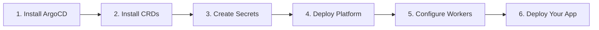

# Getting Started

This section walks you through installing Easy-Deploy on your Kubernetes cluster and deploying your first application.

## Prerequisites

Before you begin, make sure you have:

- A **Kubernetes cluster** (kubeadm, k3s, or any conformant distribution) with at least 1 master and 1 worker node
- `kubectl` configured to communicate with your cluster
- A **domain** managed by Cloudflare (e.g., `easysolution.work`)
- A **Cloudflare API token** with **Zone:DNS:Edit** and **Zone:Zone:Read** permissions
- A **GitHub account** (for hosting your platform and developer catalog repos)

## What You'll Set Up



| Step | Time | Description |
|------|------|-------------|
| [Installation](installation.md) | ~15 min | Install ArgoCD, CRDs, create secrets, deploy all platform components |
| [Quick Start](quickstart.md) | ~5 min | Deploy a pre-built container image with a single line |
| [First Deployment](first-deployment.md) | ~10 min | Build and deploy an app from a Git repository |

## Architecture at a Glance

Easy-Deploy sits on top of your Kubernetes cluster and provides a simplified deployment interface:

```
Developer YAML ──► ArgoCD ──► BirService CR ──► Operator ──► Running App
                                                  │
                                         ┌────────┴─────────┐
                                         │                   │
                                    Git Repo             Ready Image
                                    (Kaniko Build)       (Direct Deploy)
                                         │                   │
                                         └────────┬─────────┘
                                                  │
                                          Deployment + Service
                                          HTTPRoute + DNS + TLS
```

## Next Steps

Start with the [Installation Guide](installation.md) to set up your cluster.
