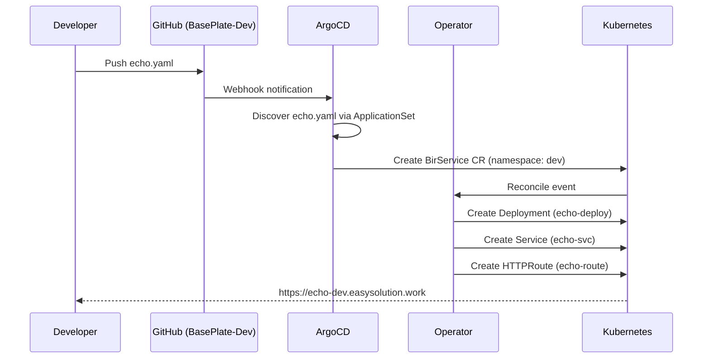

# Quick Start

Deploy a pre-built container image in under 5 minutes.

## Prerequisites

- Easy-Deploy platform is [installed](installation.md) and all pods are running
- You have a fork of or write access to the [BasePlate-Dev](https://github.com/Murad-Suleymanov/BasePlate-Dev) repository

## Deploy an Echo Server

**1.** Create a file at `echo/dev.yaml` in the BasePlate-Dev repo:

```yaml
image: ealen/echo-server:0.9.2
```

**2.** Commit and push:

```bash
git add echo/dev.yaml
git commit -m "deploy echo server to dev"
git push
```

**3.** Wait for ArgoCD to sync (usually under 3 minutes). Check progress:

```bash
kubectl -n dev get birservice
kubectl -n dev get pods
```

**4.** Access your service:

```
https://echo-dev.easysolution.work
```

!!! info "How the URL is Generated"
    The URL follows the pattern `<service>-<namespace>.easysolution.work`:

    - Folder: `echo/` → service name `echo`
    - Filename: `dev.yaml` → namespace `dev`
    - Result: `echo-dev.easysolution.work`

## What Just Happened?



The platform:

1. ArgoCD discovered `echo/dev.yaml` through the ApplicationSet
2. Rendered it through the Helm chart into a `BirService` custom resource
3. The operator reconciled the CR into a Deployment, Service, and HTTPRoute
4. ExternalDNS created a DNS A record on Cloudflare
5. The NGINX Gateway began routing traffic with TLS termination

## Deploy Something Else

Try deploying nginx:

```yaml title="nginx/dev.yaml"
image: nginx:alpine
port: 80
```

Result: **https://nginx-dev.easysolution.work**

## Next Steps

- [Deploy from a Git Repository](first-deployment.md) — Let the platform build your Docker image
- [YAML Reference](../user-guide/yaml-reference.md) — All available configuration fields
- [Validation](../user-guide/validation.md) — IDE feedback, pre-commit hooks, and PR CI for catching errors early
