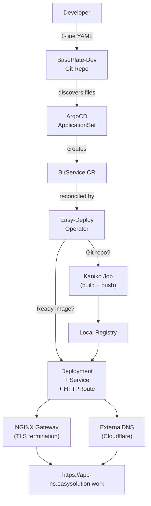

# Easy-Deploy

**A Kubernetes-native platform that turns a single-line YAML into a fully deployed, HTTPS-enabled service with automatic DNS.**

---

## The Problem

Deploying an application on Kubernetes requires deep knowledge of Deployments, Services, Ingress controllers, TLS certificates, DNS records, and container registries. A developer who just wants to ship their app faces dozens of YAML files and hours of configuration.

## The Solution

Easy-Deploy reduces the entire deployment process to **a single line of YAML**:

```yaml
repo: https://github.com/your-org/your-app
```

Within minutes, your app is live at `https://your-app-dev.easysolution.work` — with TLS, DNS, and scaling — **zero Kubernetes knowledge required**.

---

## Key Features

<div class="grid cards" markdown>

- :material-file-document-edit:{ .lg .middle } **One-Line Deployments**

    ---

    Write a single YAML field — `image:` or `repo:` — and the platform handles everything else.

- :material-crane:{ .lg .middle } **Automated Builds**

    ---

    Point to a Git repository with a Dockerfile. Kaniko builds the image in-cluster and pushes it to a local registry.

- :material-dns:{ .lg .middle } **Automatic DNS**

    ---

    ExternalDNS creates Cloudflare DNS records from HTTPRoute resources. No manual DNS management.

- :material-lock:{ .lg .middle } **Automatic HTTPS**

    ---

    cert-manager provisions a wildcard Let's Encrypt certificate via DNS-01 challenge. Every service gets TLS.

- :material-magnify:{ .lg .middle } **Port Auto-Detection**

    ---

    The operator inspects the built image to find `EXPOSE`, `ENV PORT`, or `CMD --port` directives — no manual port config.

- :material-webhook:{ .lg .middle } **Webhook Rebuilds**

    ---

    Configure a GitHub webhook and the platform automatically rebuilds and redeploys when you push code.

</div>

---

## How It Works



| Step | What Happens | Component |
|------|-------------|-----------|
| 1 | Developer commits a YAML file to the `BasePlate-Dev` repository | Developer |
| 2 | ArgoCD discovers the file and creates a `BirService` custom resource | ArgoCD ApplicationSet |
| 3a | If `image:` is set, the operator creates a Deployment, Service, and HTTPRoute | Operator |
| 3b | If `repo:` is a Git URL, the operator runs a Kaniko build, pushes to the local registry, then deploys | Operator |
| 4 | ExternalDNS reads the HTTPRoute and creates a Cloudflare DNS A record | ExternalDNS |
| 5 | A wildcard TLS certificate from Let's Encrypt covers all subdomains | cert-manager |
| 6 | Traffic flows through the NGINX Gateway with TLS termination | NGINX Gateway Fabric |

---

## Platform Components

| Component | Purpose |
|-----------|---------|
| **Easy-Deploy Operator** | Reconciles `BirService` CRs into Deployments, Services, HTTPRoutes, and Kaniko Jobs |
| **NGINX Gateway Fabric** | Gateway API ingress controller with HTTP/HTTPS listeners and TLS termination |
| **cert-manager** | Issues `*.easysolution.work` wildcard certificate via Let's Encrypt DNS-01 |
| **ExternalDNS** | Creates Cloudflare DNS A records from HTTPRoute resources |
| **Local Registry** | In-cluster Docker Registry v2 for Kaniko-built images |
| **ArgoCD** | GitOps engine syncing all platform and developer manifests |
| **Prometheus + Grafana** | Cluster monitoring and dashboards |

---

## Quick Example

=== "Container Image"

    ```yaml title="echo/dev.yaml"
    image: ealen/echo-server:0.9.2
    ```

    Result: **https://echo-dev.easysolution.work**

=== "Git Repository"

    ```yaml title="welcome/dev.yaml"
    repo: https://github.com/docker/welcome-to-docker
    ```

    Result: **https://welcome-dev.easysolution.work**

---

## Tech Stack

| Technology | Role |
|-----------|------|
| Go + controller-runtime | Custom Kubernetes operator |
| Kaniko | In-cluster container image builds |
| NGINX Gateway Fabric | Gateway API ingress controller |
| cert-manager + Let's Encrypt | Wildcard TLS certificates (DNS-01) |
| ExternalDNS + Cloudflare | Automatic DNS record management |
| ArgoCD | GitOps continuous deployment |
| Prometheus + Grafana | Monitoring and dashboards |
| Docker Registry v2 | Local container image storage |

---

<div class="grid cards" markdown>

- :material-rocket-launch: [**Getting Started**](getting-started/index.md) — Install and deploy your first app in minutes
- :material-chart-timeline-variant: [**Architecture**](architecture/index.md) — Understand how all the pieces fit together
- :material-book-open-variant: [**User Guide**](user-guide/index.md) — YAML reference, rebuild strategies, and more
- :material-wrench: [**Admin Guide**](admin-guide/index.md) — Cluster setup, worker nodes, DNS/TLS
- :material-format-list-bulleted: [**Reference**](reference/index.md) — CRD spec, configuration, troubleshooting

</div>
