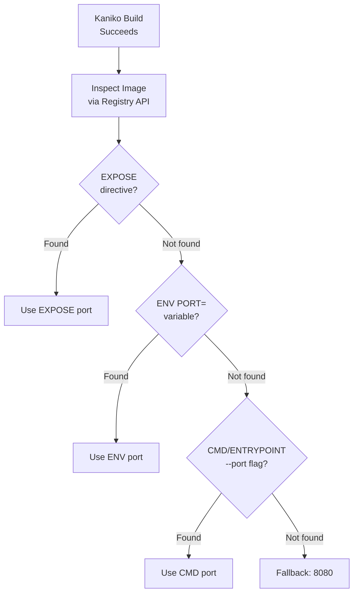

# Port Auto-Detection

One of Easy-Deploy's key features is automatic port detection — developers don't need to know or specify which port their application listens on.

## How It Works

After a successful Kaniko build, the operator queries the local registry's Docker v2 API to inspect the image configuration. It checks multiple sources to determine the correct port.



## Detection Priority

The operator checks these sources in order and uses the first match:

| Priority | Source | Dockerfile Example | Detected Port |
|----------|--------|-------------------|---------------|
| 1 | `EXPOSE` directive | `EXPOSE 3000` | `3000` |
| 2 | `ENV PORT` variable | `ENV PORT=4040` | `4040` |
| 3 | `CMD --port` flag | `CMD ["node", "server.js", "--port", "5000"]` | `5000` |
| 3 | `CMD -p` flag | `CMD ["python", "app.py", "-p", "8000"]` | `8000` |
| 3 | `ENTRYPOINT --port` flag | `ENTRYPOINT ["./server", "--port=9090"]` | `9090` |
| — | Fallback | (nothing detected) | `8080` |

## Registry API Inspection

The operator communicates with the local registry using the Docker Registry v2 API:

1. **Fetch manifest** — `GET /v2/<name>/manifests/<tag>`
    - Accepts both Docker v2 and OCI manifest media types
2. **Fetch config blob** — `GET /v2/<name>/blobs/<config-digest>`
    - Contains the image configuration with `ExposedPorts`, `Env`, `Cmd`, `Entrypoint`

### Supported Formats

| Flag | Pattern | Example |
|------|---------|---------|
| `--port` | `--port <value>` or `--port=<value>` | `--port 3000`, `--port=3000` |
| `-p` | `-p <value>` | `-p 8080` |
| `--bind` | `--bind <value>` or `--bind=<value>` | `--bind 5000` |
| `--listen` | `--listen <value>` or `--listen=<value>` | `--listen 9090` |

## Real-World Examples

### React App (EXPOSE)

```dockerfile
FROM node:18-alpine
WORKDIR /app
COPY . .
RUN npm install && npm run build
EXPOSE 3000
CMD ["npx", "serve", "-s", "build"]
```

**Detected port: `3000`** (from `EXPOSE 3000`)

### Python App (ENV PORT)

```dockerfile
FROM python:3.11-slim
WORKDIR /app
COPY . .
RUN pip install -r requirements.txt
ENV PORT=8000
CMD ["python", "app.py"]
```

**Detected port: `8000`** (from `ENV PORT=8000`)

### Go App (CMD flag)

```dockerfile
FROM golang:1.21 AS builder
WORKDIR /app
COPY . .
RUN go build -o server .

FROM gcr.io/distroless/static
COPY --from=builder /app/server /server
CMD ["/server", "--port", "4040"]
```

**Detected port: `4040`** (from `CMD` `--port` flag)

## Overriding Auto-Detection

If auto-detection doesn't find the right port (or finds the wrong one), you can always specify it explicitly:

```yaml
repo: https://github.com/your-org/your-app
port: 3000
```

When `port` is explicitly set in the YAML, auto-detection is skipped entirely.

## When Auto-Detection Doesn't Work

Auto-detection may fail when:

- The Dockerfile doesn't use `EXPOSE`, `ENV PORT`, or port flags in the command
- The port is determined at runtime from a config file or environment variable not baked into the image
- The application reads the port from a non-standard environment variable (e.g., `APP_PORT`)

In these cases, specify `port:` in your YAML.

!!! tip
    Best practice: always include `EXPOSE <port>` in your Dockerfile. It's a standard convention that helps both auto-detection and documentation.
