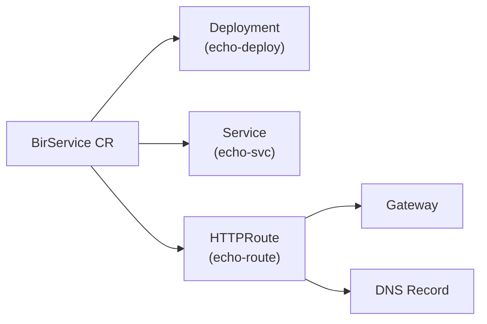

# Deploying Container Images

The simplest way to use Easy-Deploy — point to an existing container image and the platform does the rest.

## Basic Deployment

Create a YAML file in the `BasePlate-Dev` repository:

```yaml title="echo/dev.yaml"
image: ealen/echo-server:0.9.2
```

Commit and push. Within minutes:

- A `BirService` CR is created in the `dev` namespace
- The operator creates a Deployment, Service, and HTTPRoute
- ExternalDNS creates a DNS record
- Your app is live at **https://echo-dev.easysolution.work**

## Supported Registries

You can use images from any public container registry:

```yaml
# Docker Hub
image: nginx:alpine
image: ealen/echo-server:0.9.2

# GitHub Container Registry
image: ghcr.io/your-org/your-app:v1.0.0

# Google Container Registry
image: gcr.io/your-project/your-app:latest

# Any registry
image: your-registry.com/your-org/your-app:v2.0.0
```

## Specifying the Port

If your image doesn't expose port 8080, specify the port explicitly:

```yaml
image: nginx:alpine
port: 80
```

Common port mappings:

| Image | Port |
|-------|------|
| `nginx:alpine` | `80` |
| `httpd:alpine` | `80` |
| `node` apps | `3000` or `8080` |
| `python` apps | `5000` or `8000` |
| `go` apps | `8080` |

## Scaling Replicas

```yaml
image: ealen/echo-server:0.9.2
replicas: 3
```

The operator creates a Deployment with 3 replicas, and the Service load-balances across all pods.

## Updating the Image

To deploy a new version, simply change the `image` field:

```yaml
# Before
image: your-app:v1.0.0

# After (triggers redeployment)
image: your-app:v2.0.0
```

ArgoCD detects the change, updates the BirService CR, and the operator updates the Deployment — triggering a rolling update.

## What Gets Created

For each `image:` deployment, the operator creates:



| Resource | Name | Purpose |
|----------|------|---------|
| Deployment | `echo-deploy` | Runs the container pods |
| Service | `echo-svc` | ClusterIP service |
| HTTPRoute | `echo-route` | Maps hostname to service |

## Deleting a Service

Remove the YAML file from the BasePlate-Dev repository and push. ArgoCD will delete the BirService CR, and Kubernetes garbage collection will clean up all owned resources (Deployment, Service, HTTPRoute).
