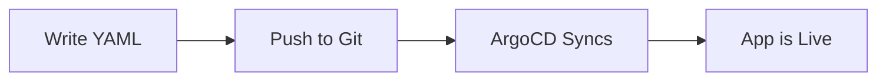

# User Guide

This section covers everything an application developer needs to know to deploy and manage applications on the Easy-Deploy platform.

## Developer Workflow



As a developer, your workflow is:

1. **Write** a simple YAML file (as little as one line)
2. **Commit** it to the `BasePlate-Dev` repository
3. **Wait** for ArgoCD to sync (1–3 minutes)
4. **Access** your application at `https://<name>-<namespace>.easysolution.work`

## File Placement

Place your YAML files in the `BasePlate-Dev` repository following this structure:

```
BasePlate-Dev/
└── tenants/
    ├── dev/
    │   └── simple-yaml/
    │       ├── echo.yaml
    │       └── welcome.yaml
    ├── staging/
    │   └── simple-yaml/
    │       └── todo-api.yaml
    └── preprod/
        └── simple-yaml/
            └── hello-world.yaml
```

The **folder name** determines the Kubernetes namespace. The **file name** determines the service name.

| Path | Namespace | Service Name | URL |
|------|-----------|-------------|-----|
| `tenants/dev/simple-yaml/echo.yaml` | `dev` | `echo` | `echo-dev.easysolution.work` |
| `tenants/staging/simple-yaml/todo-api.yaml` | `staging` | `todo-api` | `todo-api-staging.easysolution.work` |

## What Can You Deploy?

=== "Container Image"

    Deploy a ready-made container image from any public registry:

    ```yaml
    image: nginx:alpine
    ```

=== "Git Repository"

    Build and deploy from a Git repository containing a Dockerfile:

    ```yaml
    repo: https://github.com/your-org/your-app
    ```

=== "Custom Configuration"

    Customize ports, replicas, hostname, and more:

    ```yaml
    repo: https://github.com/your-org/your-app
    tag: v2.0.0
    replicas: 3
    port: 3000
    hostname: api.mycompany.com
    ```

## Guides

| Guide | Description |
|-------|-------------|
| [YAML Reference](yaml-reference.md) | Complete list of all available fields |
| [Deploying Images](deploying-images.md) | Deploy pre-built container images |
| [Deploying from Git](deploying-from-git.md) | Build images from Git repositories |
| [Rebuild Strategies](rebuild-strategies.md) | Tag-based and webhook-based rebuild triggers |
| [Port Auto-Detection](auto-detection.md) | How the platform detects your application's port |
