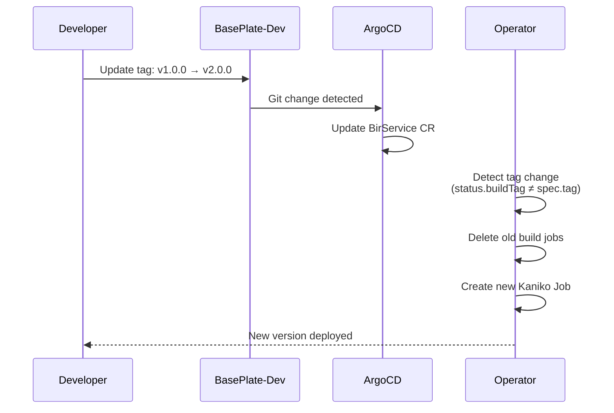
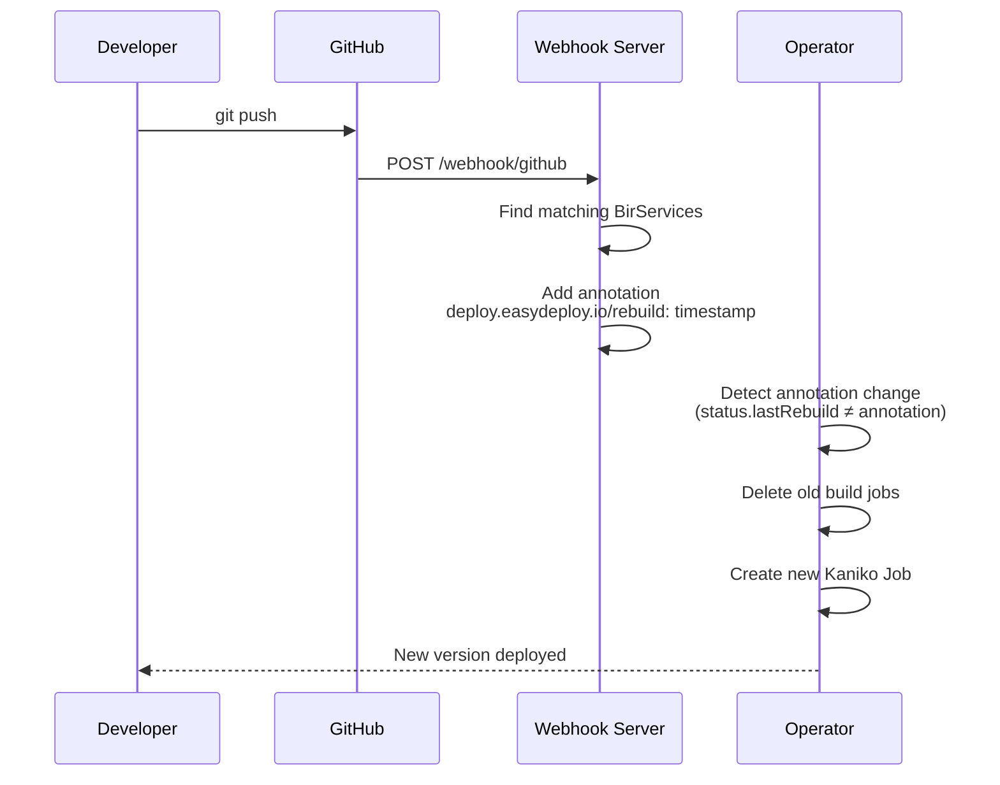

# Rebuild Strategies

Easy-Deploy supports two methods for triggering rebuilds of Git-based applications: tag-based and webhook-based.

## Tag-Based Rebuild

The simplest approach — change the `tag` field in your YAML to trigger a new build.

### How It Works



### Example

```yaml title="Before"
repo: https://github.com/your-org/your-app
tag: v1.0.0
```

```yaml title="After (triggers rebuild)"
repo: https://github.com/your-org/your-app
tag: v2.0.0
```

The operator detects that `status.BuildTag` (`v1.0.0`) differs from `spec.Tag` (`v2.0.0`), deletes the old build job, and creates a new one.

### When to Use

- Explicit version control over what's deployed
- Staging and production environments where you want controlled releases
- When you don't want every push to trigger a rebuild

## Webhook-Based Rebuild

For continuous deployment — the platform automatically rebuilds when code is pushed to the Git repository.

### How It Works



### Setting Up GitHub Webhook

1. Go to your repository's **Settings → Webhooks → Add webhook**
2. Configure:

| Field | Value |
|-------|-------|
| **Payload URL** | `https://webhook.easysolution.work/webhook/github` |
| **Content type** | `application/json` |
| **Events** | Just the `push` event |

3. Push code to your repository. The platform automatically rebuilds and redeploys.

### Matching Logic

The webhook server matches push events to BirServices by comparing the normalized repository URL:

```
Webhook payload: https://github.com/user/repo
BirService spec: https://github.com/user/repo  ← match!
```

Normalization includes:

- Lowercasing
- Removing trailing `.git`
- Removing trailing `/`

All matching BirServices across all namespaces are rebuilt.

### When to Use

- Development environments where you want instant feedback
- When multiple environments track the same repository
- Continuous integration/continuous deployment workflows

## Combining Both Strategies

You can use both strategies simultaneously:

- **Production**: Tag-based (explicit control)
- **Development**: Webhook-based (automatic on push)

```yaml title="api/prod.yaml"
repo: https://github.com/your-org/api
tag: v3.0.0  # Only changes on explicit release
```

```yaml title="api/dev.yaml"
repo: https://github.com/your-org/api
# No tag = always builds latest + rebuilds on webhook
```

## Rebuild Detection Logic

The operator checks two conditions to determine if a rebuild is needed:

```
needsRebuild = (status.buildTag ≠ desired tag)
            OR (annotation[rebuild] ≠ status.lastRebuild)
```

| Trigger | Condition |
|---------|-----------|
| Tag change | `status.BuildTag` differs from the desired image tag |
| Webhook | `deploy.easydeploy.io/rebuild` annotation differs from `status.LastRebuild` |

When a rebuild is triggered:

1. All existing build jobs for this BirService are deleted
2. A new Kaniko Job is created with the current configuration
3. The BirService status is updated with the new build tag and timestamp
